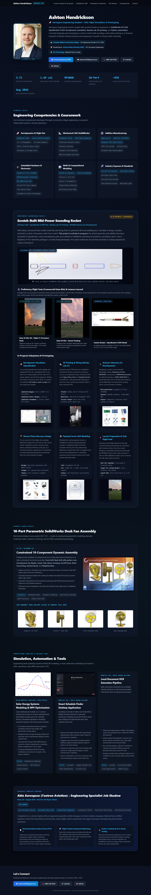

# 🚀 Ashton Hendrickson &mdash; Aerospace Engineering Portfolio

<div align="center">

[-amber?style=for-the-badge&logo=spacex)](https://github.com/ashrick12)
[](https://github.com/ashrick12)
[](https://github.com/ashrick12)
[-maroon?style=for-the-badge)](https://github.com/ashrick12)

<br/>

**Aerospace Engineering Transfer Student &bull; CAD Modeling, Flight Simulation & Additive Prototyping**

[🌐 Live Interactive Website](#-how-to-deploy--view-live) &bull; [📄 Download Resume (PDF)](assets/Ashton_Hendrickson_Resume.pdf) &bull; [💼 LinkedIn](https://www.linkedin.com/in/ashton-hendrickson-55508a262) &bull; [✉️ Email](mailto:ashtonh1204@gmail.com)

</div>

---

## 👨‍💼 Profile Overview

Aerospace Engineering transfer student with practical hands-on experience in **SolidWorks 3D CAD**, **OpenRocket 6-DOF aerodynamic simulation**, **Bambu Lab 3D printing**, and **Python automation**. 

Currently designing and prototyping a custom scratch-built sounding rocket while working as a Technical & Automation Assistant at Mobile Hearing Solutions and preparing to transfer to **Arizona State University (ASU)** for a B.S. in Aerospace Engineering (Astronautics Track).

### 🏆 Key Academic & Technical Highlights
* **3.711 Cumulative GPA** &bull; Member of Phi Theta Kappa National Honor Society.
* **1.49 cal Simulated Static Margin** in OpenRocket for scratch-built sounding rocket airframe.
* **10-Part Constrained SolidWorks Assembly** with dynamic rotational mates and 2D ANSI manufacturing drawings (ECE 103 &mdash; Grade A).
* **Aerospace Industry Immersion:** Job shadow at Able Aerospace (Textron Aviation) observing FAA airworthiness certification (Form 8110-3) and CNC dynamic flight component production.
* **Workplace Automation:** Developed a route-optimized scheduling desktop application and an offline edge OCR pipeline for clinical workflow optimization.

---

## 📸 Portfolio Preview

The portfolio is available both as an interactive dark-mode web application ([`index.html`](index.html)) and as a comprehensive markdown document ([`portfolio.md`](portfolio.md)).

<p align="center">
  
</p>

---

## 📂 Table of Contents
* [Featured Projects](#-featured-projects)
  * [1. Scratch-Built Mid-Power Sounding Rocket (In Progress)](#1-scratch-built-mid-power-sounding-rocket-in-progress)
  * [2. 10-Part Parametric SolidWorks Desk Fan Assembly](#2-10-part-parametric-solidworks-desk-fan-assembly)
  * [3. Solar Energy Systems Modeling & NPV Optimization (MATLAB)](#3-solar-energy-systems-modeling--npv-optimization-matlab)
  * [4. Smart Schedule Finder Desktop Application](#4-smart-schedule-finder-desktop-application)
  * [5. Local Document OCR Extraction Pipeline](#5-local-document-ocr-extraction-pipeline)
  * [6. Aerospace Industry Exposure: Able Aerospace (Textron Aviation)](#6-aerospace-industry-exposure-able-aerospace-textron-aviation)
* [Technical Competencies Matrix](#-technical-competencies-matrix)
* [Repository Structure](#-repository-structure)
* [How to Deploy & View Live](#-how-to-deploy--view-live)
* [Contact Information](#-contact-information)

---

## 🎯 Featured Projects

### 1. Scratch-Built Mid-Power Sounding Rocket (In Progress)
> **Status:** Actively in Prototyping & Fabrication &bull; **Unlaunched**  
> **Tools & Tech:** SolidWorks 3D CAD, OpenRocket 6-DOF Sim, Bambu Lab A1, eSUN PLA+, Polymaker PETG, Raspberry Pi Pico (RP2040)

After flying commercial Estes model rocket kits and losing them to excessive parachute drift and wadding burn, I decided to design, simulate, and build a custom mid-power rocket from scratch. 

*This project is actively in progress: vehicle aerodynamics are simulated in OpenRocket, custom structural parts are modeled in SolidWorks and 3D-printed on a Bambu Lab A1, and an RP2040-based flight telemetry sled is being coded on the bench. The custom rocket has **not yet been launched**; it is being prepared for a future local Arizona rocketry club launch.*

#### 📐 SolidWorks CAD Airframe Architecture
Modeled a complete 2.6-inch diameter (BT-80) airframe assembly in SolidWorks featuring a 24mm motor mount, custom modular payload carrier with integrated coupler shoulders, and an ogive nose cone.

<p align="center">
  
</p>

#### 🎬 Preliminary Commercial Kit Flight Tests vs. Custom Rocket
Hands-on launch experience with commercial kits (Alpha 3 and Hi-Flier) at Freestone and Crossroads Parks directly informed the engineering improvements for the custom rocket:

| Estes Hi-Flier Liftoff (Freestone Park) | High-Altitude Ascent Tracking | Custom Rocket &bull; OpenRocket 6-DOF Model |
| :---: | :---: | :---: |
|  |  |  |
| *A8-3 motor test flight. Confirmed streamer recovery stays close to pad.* | *Flight tracking verification. Flight #2 burned wadding, motivating Nomex piston.* | *Simulated vehicle geometry: CP (28.01") sits safely aft of CG (24.12") for 1.49 cal margin.* |

#### 🛠️ Subsystem Status & Prototyping Breakdown

| Subsystem | Scope & Engineering Execution | Status |
| :--- | :--- | :---: |
| **Aerodynamic Simulation** | Simulated stability in OpenRocket. Enlarged birch plywood fin sweep (5.0" sweep, 4.0" span) to push CP aft to 28.01", achieving a **1.49 cal static stability margin** with zero dead ballast weight. | **Simulated** |
| **3D Printing (Bambu Lab A1)** | Direct STEP export from CAD to Bambu Studio. Printed the full-scale **Ogive Nose Cone** and **Payload Carrier** in eSUN PLA+ with gyroid infill. Motor mount and retention clips planned in heat-resistant PETG. | **Printed** |
| **Avionics Telemetry** | Developing a custom flight datalogger using a **Raspberry Pi Pico (RP2040)**, **BMP390 barometer**, **MPU-6500 6-axis IMU**, and SPI MicroSD storage for apogee detection and flight logging. | **Bench Testing** |
| **Nomex Piston Recovery** | Engineered a flameproof Nomex cloth piston separating at the mid-joint, pushing out the 24" parachute while shielding electronics from ejection gas. | **Parts Acquired** |
| **Payload Carrier CAD** | Integrated upper and lower coupler shoulders directly into the printed body with an internal 4-legged cross-arch floor anchor to distribute shock cord tension. | **Fabricated** |

<p align="center">
  
  &nbsp;&nbsp;
  
</p>

---

### 2. 10-Part Parametric SolidWorks Desk Fan Assembly
> **Role:** Mechanical CAD Designer &bull; **Course:** ECE 103 (Grade A) &bull; **Tool:** SolidWorks 3D CAD

<p align="center">
  
</p>

* Modeled 10 discrete components from dimensioned sketches to a fully constrained assembly: Front Grill, Back Grill with radial pattern cuts, Aerodynamic Fan Blades, Center Hub, Motor Housing, On/Off Switch Knob, Shaft, Frame Ring, Vertical Stand, and Weighted Base.
* Implemented concentric, coincident, and rotational mechanical mates to simulate smooth 360° blade rotation with zero interference.
* Executed clearance checking between rotating blades and housing to eliminate collision risks.
* Authored standard 2D ANSI manufacturing drawings detailing dimensions, datum references, and tolerances.

| Isometric 3/4 View | Profile / Side View | Front Elevation View | Rear Housing View |
| :---: | :---: | :---: | :---: |
|  |  |  |  |

---

### 3. Solar Energy Systems Modeling & NPV Optimization (MATLAB)
> **Role:** Lead Mathematical Modeler &bull; **Context:** Academic Team Project &bull; **Tool:** MATLAB

<p align="center">
  
</p>

* Served as primary mathematical modeler on a 5-person engineering student team sizing an off-grid residential solar and battery storage system for Chandler, Arizona.
* Formulated mathematical balance equations correlating seasonal solar angles with photovoltaic energy generation.
* Modeled battery storage discharge profiles and multi-day reserve requirements against summer cooling loads.
* Calculated Net Present Value (NPV) lifecycle economic models comparing two competing battery configurations over a 25-year lifecycle.
* Completed MathWorks MATLAB Onramp Certification and earned an A grade on the project milestone.

---

### 4. Smart Schedule Finder Desktop Application
> **Role:** Creator & Developer &bull; **Workplace:** Mobile Hearing Solutions &bull; **Tools:** Python, Streamlit, Google Calendar API

<p align="center">
  
</p>

* Built a desktop application in Python and Streamlit for Mobile Hearing Solutions to automate technician scheduling across the Phoenix metro area.
* Queries the Google Calendar API using OAuth2 authentication with automatic token refresh to pull technician schedules.
* Suggests open time slots by checking patient addresses against existing calendar routes to reduce cross-town driving.
* Features an interactive dark-mode interface with single-patient lookups and batch searches (next 5 patients), saving an estimated 2 to 3 hours of manual route cross-checking per week in active office use.

---

### 5. Local Document OCR Extraction Pipeline
> **Role:** Technical Assistant &bull; **Workplace:** Mobile Hearing Solutions &bull; **Tools:** Python, EasyOCR, Phi-4 Mini LLM, 4-bit Quantization

* Built a document extraction tool at Mobile Hearing Solutions to pull structured patient referral data from incoming fax documents.
* Tested and implemented an offline OCR pipeline using 4-bit quantized vision models (Phi-4 Mini) and EasyOCR.
* Extracts patient demographic, insurance, and doctor referral information from multi-page scanned faxes into structured records.
* Runs entirely locally on office PC hardware to maintain strict patient HIPAA privacy and eliminate third-party cloud API costs.
* Includes manual review verification flags for low-confidence scans to ensure data accuracy before saving.

---

### 6. Aerospace Industry Exposure: Able Aerospace (Textron Aviation)
> **Role:** Engineering Specialist Job Shadow &bull; **Location:** Mesa, AZ &bull; **Date:** August 2026  
> **Facility:** FAA Part 145 Repair Station & Aerospace Manufacturing Facility

* **FAA Airworthiness Documentation:** Shadowed an engineering specialist reviewing engineering change orders, confirming airworthiness data, and walking through the documentation process submitted to the FAA under **Form 8110-3** for custom repairs and parts.
* **Flight-Critical Component Machining:** Toured the machine shop and observed multi-axis CNC milling of high-stress aircraft components including helicopter rotor hubs, transmission drive shafts, and landing gear parts.
* **Surface Treatments & Tooling:** Observed shot-peening equipment used to induce compressive stress and prevent fatigue cracking, electroplating lines, and how engineers use SolidWorks in-house to design custom inspection fixtures and water-testing tanks.

---

## 🛠️ Technical Competencies Matrix

| Discipline | Core Skills, Tools & Methods |
| :--- | :--- |
| **Aerodynamics & Propulsion** | OpenRocket 6-DOF Simulation, Center of Pressure (CP) / Center of Gravity (CG) Management, Static Stability Margin Tuning, Fin Sweep Optimization, Solid Rocket Motor Sizing (Estes / Aerotech), Piston Recovery Dynamics |
| **Mechanical CAD (SolidWorks)** | SolidWorks (Parametric Part Modeling, Multi-Body Assemblies, Concentric / Coincident / Rotational Mates, Clearance & Interference Verification, 2D ANSI Manufacturing Drawings) |
| **Additive Manufacturing** | Bambu Lab A1 Direct-Drive, Bambu Studio STEP File Slicing, eSUN PLA+ (Airframe Aerodynamics), Polymaker PETG (High-Temp Motor Mounts), Gyroid Infill Optimization |
| **Embedded Systems & Telemetry** | Raspberry Pi Pico (RP2040), BMP390 Barometer, MPU-6500 6-Axis IMU, SPI MicroSD Flash Logging, LiPo Battery & TP4056 USB-C Power Management, Breadboard & Solder Prototyping |
| **Computational Modeling** | MATLAB for Engineers, Python Programming, Calculus I, II & III, Physics I (Kinematics), Energy Balance Modeling, Net Present Value (NPV) Lifecycle Analysis |
| **Industry Exposure & Standards** | FAA Part 145 Exposure, FAA Form 8110-3 Review, Multi-Axis CNC Milling Observation, Shot-Peening Overview, NAR Safety Code, HIPAA Compliant Edge Computing |

---

## 📁 Repository Structure

```text
├── assets/                         # Visual assets, CAD renders, flight GIFs & resume
│   ├── Ashton_Hendrickson_Resume.pdf
│   ├── headshot.png
│   ├── rocket_cad_exploded.png
│   ├── rocket_launch.gif          # Estes kit preliminary test flight
│   ├── rocket_launch_far.gif      # High-altitude tracking
│   ├── rocket_openrocket_model.png
│   ├── rocket_trajectory_plot.png
│   ├── rocket_printed_parts.jpg
│   ├── rocket_avionics_haul.png
│   ├── desk_fan_poster.png
│   ├── desk_fan_iso.png / side / front / rear
│   ├── matlab_solar_plot.png
│   ├── schedule_finder_ui.png     # Smart Schedule Finder UI screenshot
│   └── portfolio_preview_honest.png
├── index.html                      # Interactive dark-mode web portfolio application
├── styles.css                      # Aerospace CSS theme, responsive grid & aspect ratios
├── portfolio.md                    # Full markdown portfolio document
├── README.md                       # GitHub repository homepage & recruiter overview
└── .gitignore                      # Git exclusion rules
```

---

## 🌐 How to Deploy & View Live

### Option 1: Free Hosting on GitHub Pages (Recommended)
This repository is 100% configured for GitHub Pages out-of-the-box:

1. Push this repository to GitHub:
   ```bash
   git remote add origin https://github.com/ashrick12/aerospace-portfolio.git
   git branch -M main
   git push -u origin main
   ```
2. On GitHub, navigate to **Settings** &rarr; **Pages**.
3. Under **Build and deployment** &gt; **Branch**, select `main` and `/ (root)`, then click **Save**.
4. In ~60 seconds, your portfolio will be live at:
   ```text
   https://ashrick12.github.io/aerospace-portfolio/
   ```

### Option 2: Run Locally
Simply double-click [`index.html`](index.html) or open it in any web browser (Chrome, Edge, Firefox).

---

## 📬 Contact Information

* **Name:** Ashton Hendrickson
* **Email:** [ashtonh1204@gmail.com](mailto:ashtonh1204@gmail.com)
* **Phone:** (480) 528-9329
* **LinkedIn:** [linkedin.com/in/ashton-hendrickson-55508a262](https://www.linkedin.com/in/ashton-hendrickson-55508a262)
* **GitHub:** [github.com/ashrick12](https://github.com/ashrick12)
* **Resume:** [Download PDF](assets/Ashton_Hendrickson_Resume.pdf)

