# 🚀 Ashton Hendrickson &mdash; Aerospace Engineering Student Portfolio

> **Aerospace Engineering Student &bull; CAD, Flight Simulation & Prototyping**  
> **GPA:** 3.711 / 4.0 &bull; **Honors:** Member, Phi Theta Kappa National Honor Society  
> **Institution:** Chandler-Gilbert Community College (Engineering Transfer) &rarr; Transferring to **Arizona State University (ASU)** (B.S. Aerospace Engineering &bull; Astronautics Track)  
> **Contact:** [ashtonh1204@gmail.com](mailto:ashtonh1204@gmail.com) &bull; (480) 528-9329 &bull; [LinkedIn](https://www.linkedin.com/in/ashton-hendrickson-55508a262) &bull; [GitHub](https://github.com/ashrick12) &bull; [Resume (PDF)](assets/Ashton_Hendrickson_Resume.pdf)

---

## 👨‍💼 Profile Overview

Aerospace Engineering transfer student with practical hands-on experience in **SolidWorks 3D CAD**, **OpenRocket 6-DOF aerodynamic simulation**, **Bambu Lab 3D printing**, and **Python automation**. Currently designing and prototyping a custom scratch-built sounding rocket while working as a Technical Assistant at Mobile Hearing Solutions and preparing to transfer to Arizona State University.

### Key Highlights:
- **3.71 Cumulative GPA** (Phi Theta Kappa National Honor Society; A's in Calculus I & II, Physics I Kinematics).
- **1.49 cal Simulated Static Margin** in OpenRocket for custom in-progress sounding rocket airframe.
- **10-Part Constrained SolidWorks Assembly** with dynamic rotational mates and 2D ANSI manufacturing drawings (ECE 103 — Grade A).
- **Job Shadow at Able Aerospace (Textron Aviation)** observing FAA airworthiness data confirmation and CNC manufacturing.
- **Clinic Automation Tools:** Developed a Python route-optimization scheduling tool and an offline document OCR pipeline.

---

## 🛠️ Core Engineering Competencies

| Discipline | Key Technical Skills & Coursework |
| :--- | :--- |
| **Aerodynamics & Flight Sim** | OpenRocket 6-DOF Simulation, Center of Pressure (CP) / Center of Gravity (CG) Management, Static Stability Margin Tuning, Fin Geometry Sizing, Commercial Motor Curves (Estes/Aerotech) |
| **Mechanical CAD (SolidWorks)** | SolidWorks (Part Modeling, Multi-Body Assemblies, Concentric & Rotational Mates, Clearance Verification, Parametric Surfacing, ANSI 2D Manufacturing Drawings) |
| **Additive Manufacturing** | Bambu Lab A1 Direct-Drive, Slicing from STEP Models, eSUN PLA+ (Airframe Aerodynamics), Polymaker PETG (High-Temp Motor Mounts), Gyroid Infill Optimization |
| **Embedded Hardware & Electronics** | Raspberry Pi Pico (RP2040), BMP390 Barometer, MPU-6500 6-Axis IMU, SPI MicroSD Flash Logging, LiPo Battery & TP4056 USB-C Charging, Breadboard Prototyping |
| **Math & Simulation** | MATLAB for Engineers, Python, Calculus I, II & III, Physics I Kinematics, Energy Balance Equations, Net Present Value (NPV) Lifecycle Analysis |
| **Industry Exposure & Standards** | FAA Part 145 Exposure, Form 8110-3 Review, Multi-Axis CNC Milling Observation, Shot-Peening Surface Treatment Overview, NAR Safety Code |

---

## 🚀 Independent Project: Scratch-Built Mid-Power Sounding Rocket (In Progress)

**Status:** Actively in Design & Fabrication &bull; **Unlaunched**  
**Tools & Materials:** SolidWorks 3D CAD, OpenRocket, Bambu Lab A1, eSUN PLA+, Polymaker PETG, Raspberry Pi Pico (RP2040)

After flying commercial Estes model rocket kits and losing them to parachute drift and wadding burn, I decided to design, simulate, and build a custom mid-power rocket from scratch. 

> **Current Project Status:** This project is actively in progress. The airframe geometry has been simulated in OpenRocket, key components are modeled in SolidWorks and 3D printed on my Bambu Lab A1, and a custom telemetry payload is currently being developed. The custom rocket has **not yet been launched**; it is being prepared for a future club launch in the Arizona desert.

### Subsystem Breakdown:

#### 1. 📐 SolidWorks CAD Airframe Architecture
- Modeled a 2.6-inch diameter (BT-80) airframe assembly in SolidWorks housing a 24mm motor mount, payload carrier, and ogive nose cone.
- Modeled the central **Payload Carrier** with integrated upper and lower coupler shoulders to eliminate separate parts.
- Designed a **4-legged cross-arch anchor** on the bulkhead floor to distribute parachute shock tension across solid printed perimeters.

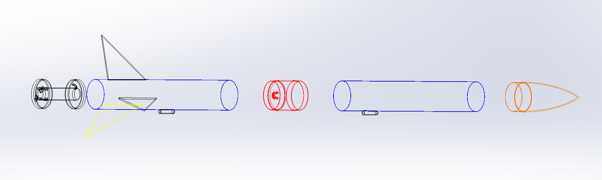

#### 2. 🎬 Preliminary Flight Tests (Commercial Estes Kits) & Lessons Learned
Before designing the custom airframe, I launched commercial Estes kits (Alpha 3 and Hi-Flier) to gain practical flight experience:
- **Flight 1 (Hi-Flier, A8-3 Motor, Freestone Park):** Flew straight and landed ~30 ft from the pad. Confirmed streamer recovery stays close compared to parachute drift.
- **Flight 2 (Hi-Flier, C6-5 Motor):** Wadding burned out and caught fire in the mud, demonstrating the need for a flameproof Nomex recovery barrier.
- **Alpha 3 (Crossroads Park):** Drifted away on a C-grade motor under a parachute, proving the need for careful motor sizing and launch rod length.

| Estes Hi-Flier Liftoff (Freestone Park) | High-Altitude Ascent Tracking | Custom Rocket OpenRocket Model |
| :---: | :---: | :---: |
|  |  | 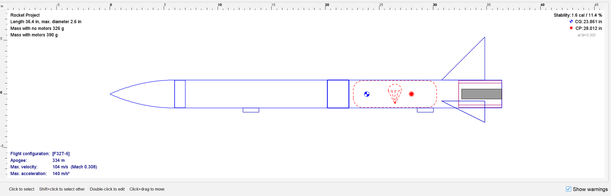 |

#### 3. 🚀 Aerodynamic Simulation (OpenRocket)
- In the initial OpenRocket simulation, stability was marginal (0.745 cal).
- Redesigned the fin geometry (4.0" root chord, 4.0" span, 5.0" sweep length, 51.3° sweep angle) in aircraft birch plywood, shifting the Center of Pressure aft to 28.01" to achieve a simulated **1.49 calibers static margin** with zero dead nose weight.
- Sized a 24" parachute for an estimated desert landing speed of **5.76 m/s** to protect printed parts on touchdown.

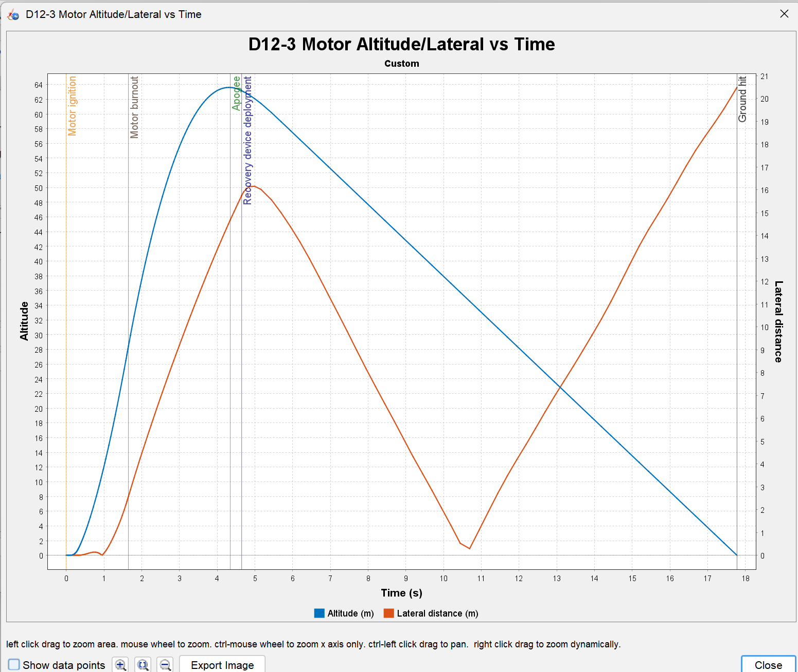

#### 4. 🖨️ 3D Printing on Bambu Lab A1
- Exported parts directly as STEP files into Bambu Studio to preserve continuous curves.
- Printed the full-scale **Ogive Nose Cone** and **Payload Carrier** in eSUN PLA+ with gyroid infill.
- Planning to print the aft 24mm motor mount and retention clips in heat-resistant Polymaker PETG to withstand motor heat.

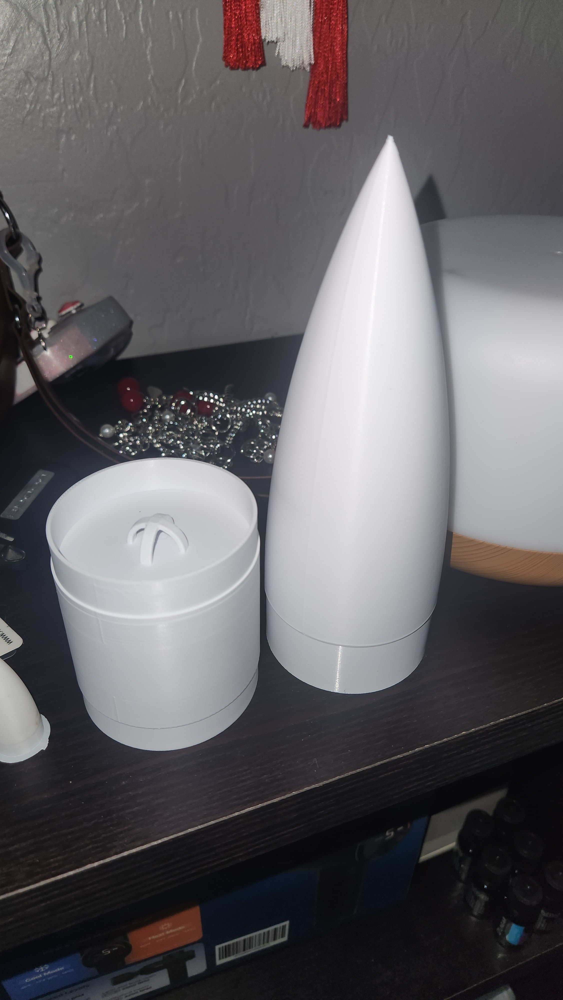

#### 5. 🛰️ Avionics Telemetry (In Development)
- Building a custom datalogger based on a **Raspberry Pi Pico (RP2040)**.
- Integrates a **BMP390 barometer** for altitude tracking, an **MPU-6500 IMU** for acceleration/tilt, and an SPI MicroSD module to save flight data.
- Hardware is purchased; sensor communication and datalogging code are currently being bench-tested in Python.

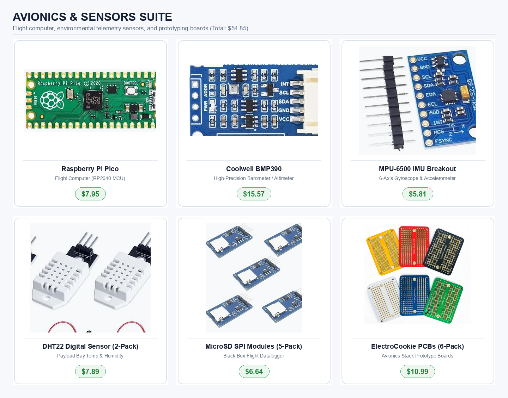

#### 6. 🪂 Nomex Piston Recovery Design
- Designed a middle-joint separation mechanism using a flameproof Nomex cloth piston to push out the parachute while protecting payload electronics from hot motor ejection gases.
- Both airframe halves will remain tethered via a 12-foot shock cord in compliance with NAR safety guidelines.

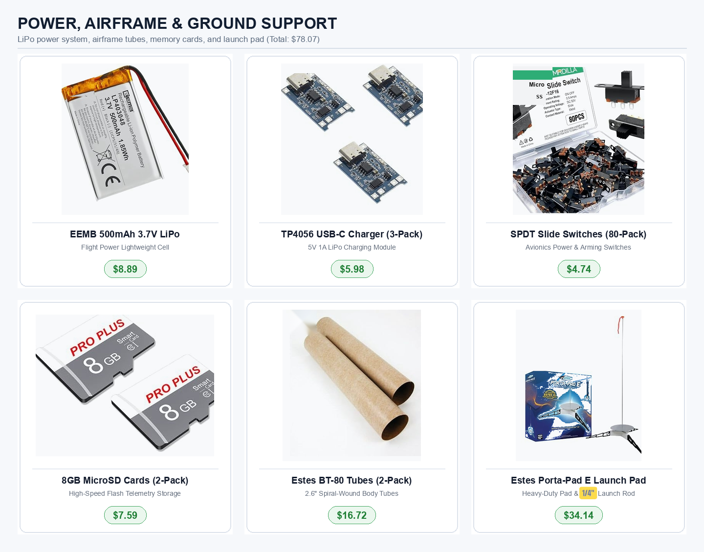

---

## 📐 Course Project: 10-Part Parametric SolidWorks Desk Fan Assembly

**Role:** Mechanical CAD Designer &bull; **Course:** ECE 103 (Grade A) &bull; **Tool:** SolidWorks 3D CAD

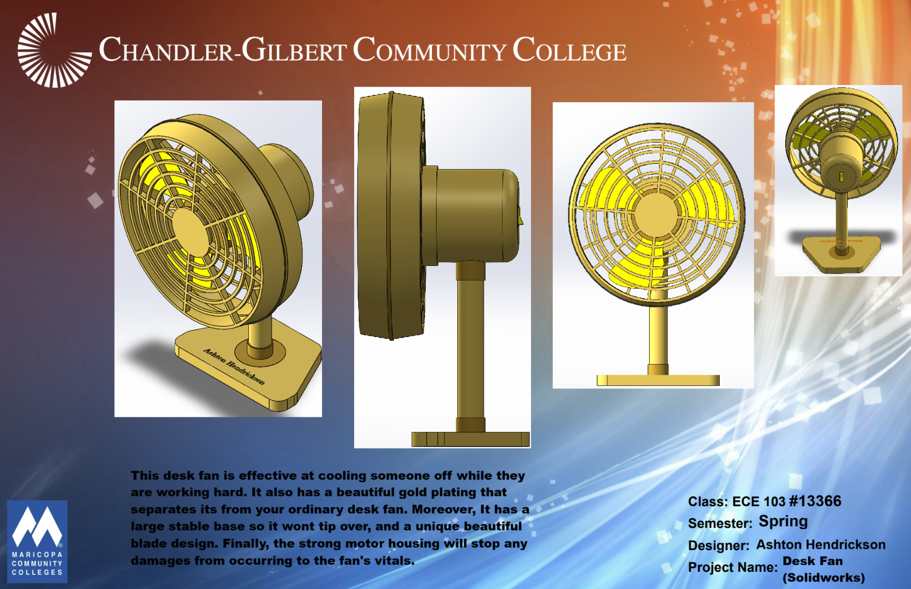

- Modeled 10 discrete mechanical parts from dimensioned paper sketches to a fully constrained assembly: Front Grill, Back Grill with pattern cuts, Fan Blades, Center Hub, Motor Housing, On/Off Knob, Shaft, Frame Ring, Vertical Stand, and Base.
- Applied **concentric, coincident, and rotational mates** to simulate 360° blade rotation without interference.
- Checked clearances between rotating blades and housing to ensure no part overlap.
- Produced **2D ANSI manufacturing drawings** detailing dimensions, datum references, and tolerances.

| Isometric 3/4 View | Profile / Side View | Front Elevation View | Rear Housing View |
| :---: | :---: | :---: | :---: |
| 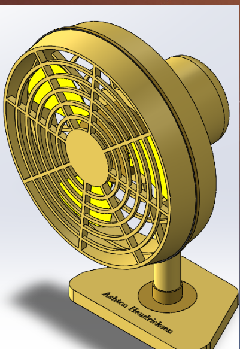 | 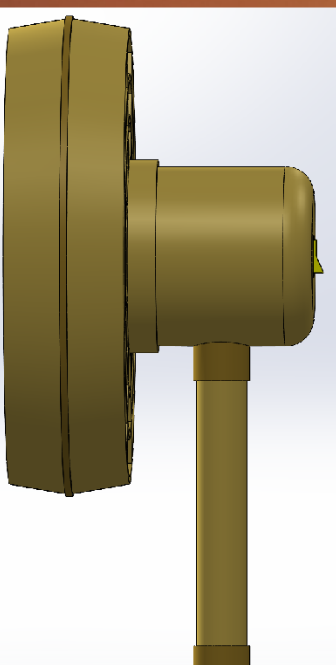 | 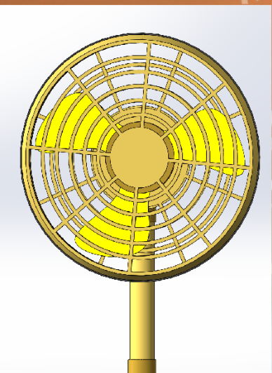 | 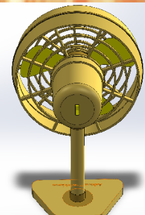 |

---

## 💻 Simulation & Software Projects

### 1. Solar Energy Systems Modeling & NPV Optimization (MATLAB)
**Role:** Lead Mathematical Modeler &bull; **Course Project** &bull; **Tool:** MATLAB

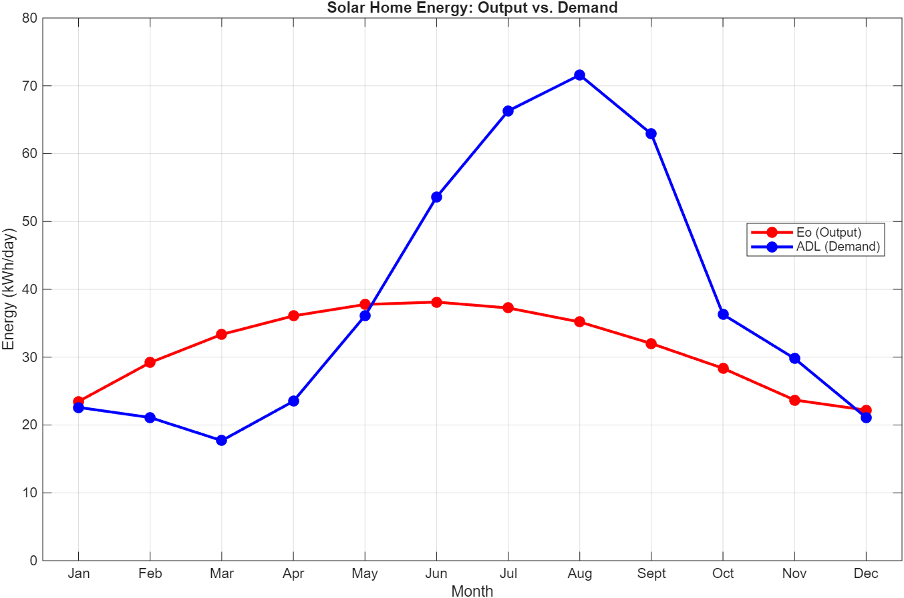

- Served as primary mathematical modeler on a 5-person engineering student team sizing an off-grid residential solar and battery storage system for Chandler, Arizona.
- Programmed mathematical equations modeling seasonal solar irradiance curves against residential energy demand.
- Calculated Net Present Value (NPV) lifecycle costs comparing two battery storage configurations over a 25-year lifespan.
- Completed MathWorks MATLAB Onramp Certification and earned an A grade on the project milestone.

---

### 2. Smart Schedule Finder Desktop Application (Python & Streamlit)
**Role:** Creator & Developer &bull; **Workplace:** Mobile Hearing Solutions &bull; **Tools:** Python, Streamlit, Google Calendar API

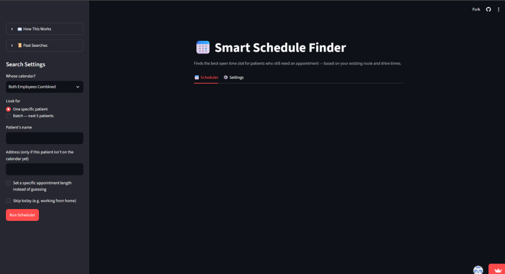

- Built a desktop application in Python and Streamlit for Mobile Hearing Solutions to automate patient appointment scheduling across the Phoenix metro area.
- Interfaces with the Google Calendar API via OAuth2 authentication with automatic token refresh.
- Suggests available appointment slots by checking patient locations against existing technician routes to minimize driving time.
- Features single-patient search and batch lookup modes (next 5 patients), saving an estimated 2 to 3 hours of manual route checking weekly in active office use.

---

### 3. Local Document OCR Extraction Pipeline
**Role:** Technical Assistant &bull; **Workplace:** Mobile Hearing Solutions &bull; **Tools:** Python, EasyOCR, Phi-4 Mini LLM

- Implemented an offline document extraction pipeline to pull patient demographic, insurance, and doctor referral data from incoming faxed PDFs into structured records.
- Tested and ran 4-bit quantized local vision models (Phi-4 Mini) alongside EasyOCR.
- Operates 100% locally on office PC hardware to preserve patient privacy in compliance with HIPAA guidelines and eliminate cloud API fees.
- Includes manual verification flags for low-confidence scans to ensure data accuracy.

---

## ✈️ Aerospace Industry Exposure: Able Aerospace (Textron Aviation)

**Role:** Engineering Specialist Job Shadow &bull; **Location:** Mesa, AZ &bull; **Date:** August 2026  
**Facility:** FAA Part 145 Repair Station & Aerospace Manufacturing Facility

- **FAA Airworthiness Documentation:** Shadowed an engineering specialist reviewing engineering change orders, confirming airworthiness data, and walking through documentation submitted to the FAA under **Form 8110-3**.
- **Flight-Critical Component Machining:** Toured the machine shop and observed multi-axis CNC milling of high-stress aircraft components including helicopter rotor hubs, transmission drive shafts, and landing gear parts.
- **Surface Treatments & Tooling:** Observed shot-peening processes used to induce compressive stress and prevent fatigue cracking, electroplating lines, and how engineers use SolidWorks in-house to design custom inspection fixtures and water-testing tanks.

---

## 📬 Contact & Links

- **Email:** [ashtonh1204@gmail.com](mailto:ashtonh1204@gmail.com)
- **Phone:** (480) 528-9329
- **LinkedIn:** [linkedin.com/in/ashton-hendrickson-55508a262](https://www.linkedin.com/in/ashton-hendrickson-55508a262)
- **GitHub:** [github.com/ashrick12](https://github.com/ashrick12)
- **Resume:** [Download PDF](assets/Ashton_Hendrickson_Resume.pdf)
- **Live Portfolio Website:** [ashrick12.github.io](https://ashrick12.github.io/)
- **Interactive Webpage:** [Open index.html](index.html)
