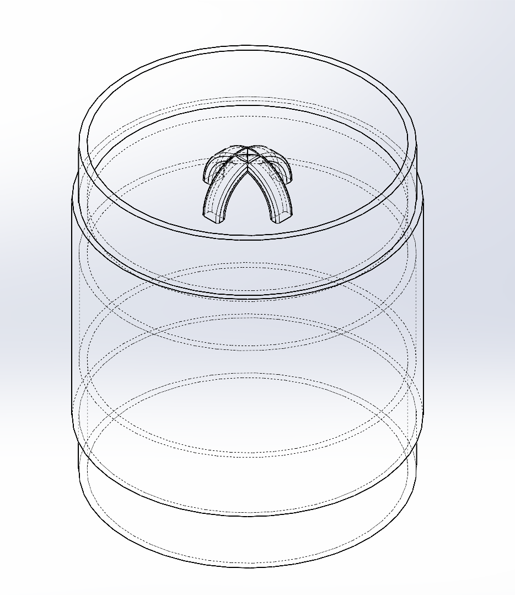
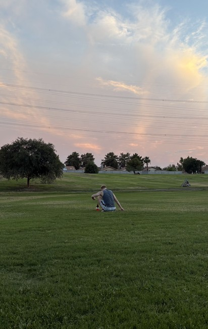

# Ashton Hendrickson &mdash; Aerospace Engineering Portfolio

> **Aerospace Engineering Student &bull; CAD, Flight Simulation & Prototyping**  
> **GPA:** 3.711 / 4.0 &bull; **Honors:** Member, Phi Theta Kappa National Honor Society  
> **Institution:** Chandler-Gilbert Community College (Engineering Transfer) &rarr; Transferring to **Arizona State University (ASU)** (B.S. Aerospace Engineering &bull; Astronautics Track)  
> **Contact:** [ashtonh1204@gmail.com](mailto:ashtonh1204@gmail.com) &bull; [LinkedIn](https://www.linkedin.com/in/ashton-hendrickson-55508a262) &bull; [GitHub](https://github.com/ashrick12) &bull; [Live Website](https://ashrick12.github.io/)

---

## Profile Overview

Aerospace Engineering transfer student with practical hands-on experience in **SolidWorks 3D CAD**, **OpenRocket flight simulation**, **Bambu Lab 3D printing**, and **Python automation**. Currently designing and prototyping a custom scratch-built sounding rocket while working as a Technical Assistant at Mobile Hearing Solutions and preparing to transfer to Arizona State University.

### Key Highlights
- **3.711 Cumulative GPA** (Phi Theta Kappa National Honor Society; A's in Calculus I & II, Physics I Kinematics).
- **1.49 cal Static Stability Margin** in OpenRocket for custom in-progress sounding rocket airframe.
- **10-Part Constrained SolidWorks Assembly** with dynamic rotational mates and 2D ANSI manufacturing drawings (ECE 103 &mdash; Grade A).
- **Aerospace Job Shadow at Able Aerospace (Textron Aviation)** observing FAA airworthiness data confirmation (Form 8110-3) and dynamic flight component manufacturing.
- **Clinic Automation Tools:** Developed a Python route-optimization scheduling tool and an offline edge OCR pipeline for healthcare operations.

---

## 01 / Aerospace Hardware: Scratch-Built Sounding Rocket

**Project Status:** In Progress &bull; **Unlaunched**  
**Engineering Lifecycle:** Design &rarr; Simulation &rarr; Fabrication &rarr; Avionics &rarr; Recovery &rarr; Flight Testing  
**Tools & Materials:** SolidWorks 3D CAD, OpenRocket, Bambu Lab A1, eSUN PLA+, Polymaker PETG, Raspberry Pi Pico (RP2040)

After flying commercial Estes model rocket kits and losing them to excessive parachute drift and wadding burn, I decided to design, simulate, and build a custom mid-power rocket from scratch. 

> **Current Status:** This project is actively in progress. Vehicle geometry and aerodynamic stability have been simulated in OpenRocket, custom structural parts are modeled in SolidWorks and 3D printed on my Bambu Lab A1, and a custom telemetry payload is currently being bench-tested. The custom rocket has **not yet been launched**; it is being prepared for a future club launch in the Arizona desert.

### SolidWorks Rocket CAD Assembly
Modeled a complete 2.6-inch diameter (BT-80) airframe assembly in SolidWorks housing a 24mm motor mount, custom modular payload carrier with integrated coupler shoulders, and an ogive nose cone.

### Preliminary Commercial Kit Flight Tests & Failure Analysis
Hands-on launch experience with commercial kits (Alpha 3 and Hi-Flier) at Freestone and Crossroads Parks directly informed the engineering requirements for the custom vehicle:
- **Flight 1 (Hi-Flier, A8-3 Motor, Freestone Park):** Flew straight to ~400 ft and landed ~30 ft from the pad. Confirmed streamer recovery stays close compared to parachute drift.
- **Flight 2 (Hi-Flier, C6-5 Motor):** Ejection wadding burned through and caught fire, demonstrating the need for a flameproof Nomex recovery barrier.
- **Alpha 3 (Crossroads Park):** Drifted excessively on a C-grade motor under parachute recovery, highlighting the need for careful motor sizing and launch rod length.

| Estes Hi-Flier Liftoff (Freestone Park) | High-Altitude Ascent Tracking | OpenRocket Flight Simulation Model |
| :---: | :---: | :---: |
|  |  |  |
| *A8-3 motor test flight. Confirmed streamer recovery stays close to pad.* | *Flight tracking verification. Flight #2 burned wadding, motivating Nomex piston.* | *Simulated geometry: CP (28.01") sits safely behind CG (24.12") for 1.49 cal margin.* |

### In-Progress Subsystems & Hardware Breakdown

#### 1. Aerodynamic Simulation (OpenRocket)
- Redesigned the fins after initial simulations showed marginal stability (0.745 cal), moving the center of pressure aft to 28.01" and improving the static margin to **1.49 calibers** with zero dead ballast weight.
- Sized a 24" parachute for an estimated desert landing speed of **5.76 m/s** to protect 3D-printed parts on touchdown.
- Simulated apogee of **268 m (~880 ft)** on an Aerotech F32 composite motor.

#### 2. Additive Manufacturing (Bambu Lab A1)
- Exported SolidWorks models as STEP files directly into Bambu Studio and printed the aerodynamic components with smooth curved surfaces.
- Printed the full-scale **Ogive Nose Cone** and **Payload Carrier** in eSUN PLA+ with gyroid infill.
- Motor mount brackets and retention clips are scheduled for printing in high-heat Polymaker PETG.

#### 3. Avionics Telemetry Datalogger (RP2040)
- Developing an onboard telemetry package based on the **Raspberry Pi Pico (RP2040)**.
- Integrates a **BMP390 precision barometer** for altitude tracking, an **MPU-6500 6-axis IMU** for acceleration and tilt, and an SPI MicroSD module to write high-frequency flight telemetry to flash memory.
- Hardware is acquired; sensor communication and datalogging routines are currently being bench-tested in Python.

#### 4. Flameproof Piston Recovery Design
- To permanently prevent wadding burn-through experienced on Estes flights, designed a piston recovery mechanism.
- A flameproof Nomex cloth piston pushes the 24" parachute out of the recovery tube while protecting payload electronics from hot motor gases.
- Both airframe halves remain tethered via a 12-foot tubular elastic shock cord in compliance with NAR safety standards.

#### 5. Payload Carrier CAD Modeling
- Modeled the central payload section in SolidWorks with integrated upper and lower coupler shoulders to eliminate separate joint components.
- Designed a **4-Legged Shock Cord Anchor** across the bulkhead floor to distribute parachute opening shock evenly into solid perimeter walls.

#### 6. Field Launch Operations & Goals
- Gained field launch experience through commercial kit flights at Freestone and Crossroads Parks using an Estes Porta-Pad E with a 5-ft steel rod.
- Preparing the custom vehicle for an Arizona rocketry club launch in open desert terrain upon final bench integration.

---

## 02 / Mechanical Design: 10-Part SolidWorks Desk Fan Assembly

**Role:** Mechanical CAD Designer &bull; **Course:** ECE 103 (Grade A) &bull; **Tool:** SolidWorks 3D CAD

- Modeled 10 discrete mechanical parts from dimensioned paper sketches to a fully constrained assembly: Front Grill, Back Grill with pattern cuts, Aerodynamic Fan Blades, Center Hub, Motor Housing, On/Off Switch Knob, Shaft, Frame Ring, Vertical Stand, and Base.
- Applied **concentric, coincident, and rotational mechanical mates** to simulate smooth 360° blade rotation with zero interference.
- Checked clearances between rotating blades and housing to ensure no dynamic part collision.
- Generated comprehensive **2D ANSI manufacturing drawings** detailing dimensions, datum references, and standard tolerances.
- Produced multi-angle photorealistic renders in SolidWorks PhotoView.

| Isometric 3/4 View | Profile / Side View | Front Elevation View | Rear Housing View |
| :---: | :---: | :---: | :---: |
|  |  |  |  |

---

## 03 / Simulation & Software Tools

### 1. Solar Energy Systems Modeling & NPV Optimization (MATLAB)
**Role:** Lead Mathematical Modeler &bull; **Course Project** &bull; **Tool:** MATLAB

- Served as primary mathematical modeler on a 5-person engineering student team sizing an off-grid residential solar and battery storage system for Chandler, Arizona.
- Formulated mathematical energy-balance equations correlating seasonal solar angles with photovoltaic panel output.
- Modeled battery storage discharge profiles and multi-day reserve requirements against summer cooling loads.
- Calculated Net Present Value (NPV) lifecycle economic models comparing two competing battery configurations over a 25-year lifespan.
- Completed MathWorks MATLAB Onramp Certification and earned an A grade on the project milestone.

---

### 2. Smart Schedule Finder Desktop Application (Python & Streamlit)
**Role:** Creator & Developer &bull; **Workplace:** Mobile Hearing Solutions &bull; **Tools:** Python, Streamlit, Google Calendar API

- Built a desktop application in Python and Streamlit for Mobile Hearing Solutions to automate technician scheduling across the Phoenix metro area.
- Queries the Google Calendar API via OAuth2 authentication with automatic background token refresh to ingest real-time schedules.
- Evaluates proposed patient addresses against existing technician routes to minimize cross-town driving time.
- Features single-patient lookups and automated batch searches (next 5 patients), saving an estimated 2 to 3 hours of manual route cross-referencing weekly in active office use.

---

### 3. Local Document OCR Extraction Pipeline
**Role:** Technical Assistant &bull; **Workplace:** Mobile Hearing Solutions &bull; **Tools:** Python, EasyOCR, Phi-4 Mini (4-bit)

- Implemented an offline document extraction pipeline to pull patient demographic, insurance, and doctor referral fields from incoming faxed PDFs into structured records.
- Tested and ran 4-bit quantized local vision models (Phi-4 Mini) alongside EasyOCR.
- Operates 100% locally on office workstations to maintain strict patient privacy in compliance with HIPAA guidelines and eliminate cloud API fees.
- Includes manual verification flags for low-confidence scans to ensure data accuracy before database ingestion.

---

## 04 / Aerospace Industry Experience: Able Aerospace (Textron Aviation)

**Role:** Engineering Specialist Job Shadow &bull; **Location:** Mesa, AZ &bull; **Date:** August 2026  
**Facility:** FAA Part 145 Repair Station & Aerospace Manufacturing Facility

- **FAA Airworthiness Documentation:** Shadowed an engineering specialist reviewing engineering change orders, confirming airworthiness data, and walking through documentation submitted to the FAA under **Form 8110-3** for custom repairs and parts.
- **Flight-Critical Component Machining:** Toured the machine shop and observed multi-axis CNC milling of high-stress aircraft components including helicopter rotor hubs, transmission drive shafts, and landing gear parts.
- **Surface Treatments & Tooling:** Observed shot-peening processes used to induce compressive stress and prevent fatigue cracking, electroplating lines, and how engineers use SolidWorks in-house to design custom inspection fixtures and water-testing tanks.

---

## 05 / Technical Skills & Tools

| Category | Core Skills, Tools & Methods |
| :--- | :--- |
| **01 — Aerodynamics & Propulsion** | OpenRocket Flight Simulation, Center of Pressure / Center of Gravity, Static Stability Margin Tuning, Fin Geometry Optimization, Motor Sizing (Estes / Aerotech), Streamer vs. Parachute Drift Analysis, Nomex Piston Recovery |
| **02 — Mechanical CAD & Prototyping** | SolidWorks (Parametric Part Modeling, Multi-Body Assemblies, Dynamic Rotational Mates, Clearance Verification, 2D ANSI Manufacturing Drawings), Bambu Lab A1, Bambu Studio STEP Slicing, eSUN PLA+, Polymaker PETG, Gyroid Infill Optimization |
| **03 — Hardware, Software & Standards** | Raspberry Pi Pico (RP2040), BMP390 Barometer, MPU-6500 6-Axis IMU, SPI MicroSD Flash Logging, LiPo Battery & TP4056 Power, MATLAB, Python, Calculus I-III, Kinematics (Physics I), FAA Part 145 Exposure, FAA Form 8110-3, NAR Safety Code |

---

## Contact & Links

- **Email:** [ashtonh1204@gmail.com](mailto:ashtonh1204@gmail.com)
- **LinkedIn:** [linkedin.com/in/ashton-hendrickson-55508a262](https://www.linkedin.com/in/ashton-hendrickson-55508a262)
- **GitHub:** [github.com/ashrick12](https://github.com/ashrick12)
- **Live Portfolio Website:** [ashrick12.github.io](https://ashrick12.github.io/)
- **Interactive Webpage:** [Open index.html](index.html)
