# Ashton Hendrickson &mdash; Aerospace Engineering Portfolio

> **Aerospace Engineering Student &bull; CAD, Flight Dynamics & Additive Prototyping**  
> **Education:** Chandler-Gilbert Community College &rarr; Transferring to **Arizona State University (ASU)** (B.S. Aerospace Engineering &bull; Astronautics Track)  
> **Contact:** [ashtonh1204@gmail.com](mailto:ashtonh1204@gmail.com) &bull; [LinkedIn](https://www.linkedin.com/in/ashton-hendrickson-55508a262/) &bull; [GitHub](https://github.com/ashrick12) &bull; [Live Website](https://ashrick12.github.io/)

---

## Profile Overview

Aerospace Engineering transfer student with hands-on experience in **SolidWorks 3D CAD**, **OpenRocket flight simulation**, **Bambu Lab 3D printing**, and **Python automation**. I recently designed, built, and flew my first scratch-built sounding rocket, and I work as a Technical Assistant at Mobile Hearing Solutions while preparing to transfer to Arizona State University.

### Key Highlights
- **Completed First Test Flight:** Flew on an Estes D12-3 motor at Freestone Park with 27.06 s total flight time (+0.26 s off 5° OpenRocket sim); rocket recovered intact with no visible structural damage.
- **OpenRocket 3D Flight Visualizer:** Developed an interactive Three.js WebGL trajectory replay engine transforming OpenRocket CSV exports into 3D flight replays over calibrated Freestone Park satellite terrain.
- **Computational Physics Simulation:** Built an interactive 3D WebGL electrostatic simulation demonstrating the mathematical invariance of Electric Potential ($V$) vs. Potential Energy ($U$) using Velocity Verlet integration.
- **1.60 cal Static Stability Margin:** Tuned Barrowman stability in OpenRocket across Estes D12-3 (maiden flight motor, 63.6 m apogee) and Aerotech F32T-6 mid-power motor (334 m / 1,095 ft apogee).
- **Assembled 36.4" Sounding Rocket:** Custom BT-80 airframe with 309g measured empty mass (326g simulated dry mass with avionics allocation) and finished in gold livery.
- **MicroPython Avionics Bench Testing:** Dual-core Raspberry Pi Pico (RP2040) breadboard setup tested with DHT and MPU-6500 sensors ahead of Flight 2 BMP390 barometer integration.
- **10-Part Constrained SolidWorks Assembly:** Parametric desk fan with dynamic rotational mates, clearance verification, and 2D ANSI manufacturing drawings.
- **Additive Prototyping & Caliper Tolerancing:** Bambu Lab A1 printing in eSUN PLA+ and Polymaker PETG; redesigned parts to match physical 65.5mm BT-80 airframe inner diameter.
- **Aerospace Job Shadow at Able Aerospace (Textron Aviation):** Shadowed dynamic component overhaul observing FAA airworthiness data confirmation (Form 8110-3) and multi-axis CNC rotor machining.
- **Clinic Automation Tools:** Developed a Python route-optimization scheduling tool and an offline edge OCR pipeline for healthcare operations.

---

## 01 / Aerospace Hardware: Scratch-Built Sounding Rocket

**Project Status:** First Test Flight Complete &bull; **Rocket Recovered Intact**  
**Engineering Lifecycle:** 01 Design &rarr; 02 Simulation &rarr; 03 Fabrication &rarr; 04 Avionics &rarr; 05 Recovery &rarr; 06 Flight Testing (Flight 1 Complete &bull; Flight 2 Prep)  
**Tools & Materials:** SolidWorks 3D CAD, OpenRocket, Bambu Lab A1, eSUN PLA+, Polymaker PETG, Raspberry Pi Pico (RP2040), MicroPython, 350 lb Braided Kevlar, JB-Weld Epoxy

After flying commercial Estes model rocket kits and running into practical issues like burned wadding and wind drift, I designed, simulated, built, and launched a 36.4" scratch-built model rocket from the ground up.

> **Current Status:** On September 19, 2026, I completed the maiden test flight on an Estes D12-3 motor at Freestone Park, launching with an empty payload bay to focus the test on basic vehicle flight performance. The rocket completed a clean flight, deployed its parachute near apogee, and was recovered intact on the grass with no visible structural damage. Flight time was 27.06 s compared to 26.8 s in the 5° OpenRocket simulation. Work is now focused on integrating the onboard flight computer (RP2040 + BMP390 + MPU-6500) for Flight 2.  
> **Flight Video:** Uncut 39-second handheld test flight recording ([mid-launch cover](assets/rocket_flight_midlaunch.jpg)) available at [rocket_test_flight_1.mp4](assets/rocket_test_flight_1.mp4).

### Vehicle Specifications

| Specification | Value / Description | Engineering Context |
| :--- | :--- | :--- |
| **Total Length** | 36.4 in (92.4 cm) | Custom BT-80 modular airframe stack |
| **Outer Diameter** | 2.60 in (66.0 mm) | Estes BT-80 body tube standard |
| **Measured Inner Diameter** | 65.5 mm (2.58 in) | Caliper verified; +1.0mm over catalog, prompted CAD resize |
| **Airframe Dry Mass (Measured)** | 309 g | Physical empty airframe on scale (no motor or payload) |
| **Simulated Dry Mass w/ Avionics** | 326 g | OpenRocket model incorporating forward avionics allocation |
| **Flight Mass (Estes D12-3)** | 370 g | Loaded liftoff mass for maiden test flight at Freestone Park |
| **Flight Mass (Aerotech F32T-6)** | 390 g | Loaded liftoff mass for mid-power upgrade flight |
| **Center of Gravity (CG)** | 23.86 in (from nose tip) | OpenRocket model with forward payload allocation |
| **Center of Pressure (CP)** | 28.01 in (from nose tip) | Barrowman aerodynamic center of pressure |
| **Static Stability Margin** | **1.60 cal** | Solidly within the 1.0–2.0 caliber passive stability window |

### Engine Trade Study: Estes D12-3 vs. Aerotech F32T-6

| Propulsion Metric | Estes D12-3 (Test Flight 1) | Aerotech F32T-6 (Upgrade Target) |
| :--- | :--- | :--- |
| **Motor Classification** | Low-Power Black Powder (D Class) | Mid-Power Composite Propellant (F Class) |
| **Total Impulse** | 20.0 N·s | 58.0 N·s |
| **Simulated Apogee** | **63.6 m (209 ft)** | **334 m (1,095 ft)** |
| **Max Velocity** | 28.8 m/s (64.4 mph) | 104 m/s (233 mph / Mach 0.31) |
| **Max Acceleration** | 56.4 m/s² (5.75 G) | 140 m/s² (14.3 G) |
| **Time to Apogee** | 3.86 s | 7.91 s |
| **Flight Duration** | 15.3 s | 74.5 s |
| **Ejection Delay** | 3 seconds (nominal) | 6 seconds (nominal) |
| **Deployment Velocity** | 4.36 m/s | 6.84 m/s |
| **Touchdown Velocity** | 5.65 m/s (24" chute) | 5.65 m/s (24" chute) |
| **Nominal Wind Drift** | ~20 m (Freestone Park) | ~175 m (Desert Launch Site) |

---

### SolidWorks CAD Mechanical Stack

Modeled the complete vehicle stack assembly in SolidWorks housing a 24mm motor mount, BT-80 airframe tubes, 3D-printed modular payload carrier with integrated coupler shoulders and avionics sled bosses, recovery chamber, and an ogive nose cone.

---

### Preliminary Commercial Kit Flight Tests & Failure Analysis

Hands-on flight testing with commercial kits (Alpha 3 and Hi-Flier) at Freestone and Crossroads Parks directly established engineering requirements for the custom sounding rocket:
- **Flight 1 (Hi-Flier, A8-3 Motor, Freestone Park):** Stable pad exit and straight ascent to ~400 ft, landing ~30 ft from pad. Confirmed low-drift recovery behavior in light surface winds.
- **Flight 2 (Hi-Flier, C6-5 Motor):** Ejection wadding burned through and caught fire, proving standard wadding is inadequate and mandating a flame-resistant Nomex piston barrier.
- **Alpha 3 (Crossroads Park):** Parachute drift carried vehicle off-bounds on a C-grade motor, demonstrating the critical need for trajectory dispersion modeling and field-specific drift envelopes.

| Subscale Pad Liftoff | High-Altitude Optical Tracking | Passive Stability Model | Fully Assembled Rocket |
| :---: | :---: | :---: | :---: |
|  |  |  | 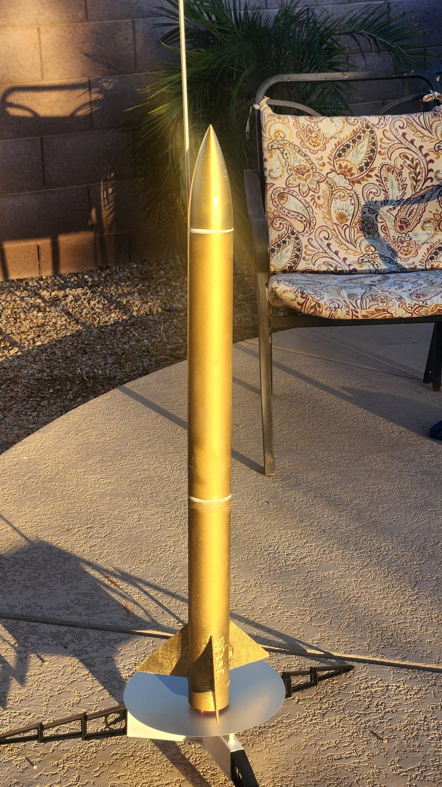 |
| *Estes launch at Freestone Park.* | *Tracking optical ascent & drift.* | *OpenRocket stability model (1.60 cal).* | *36.4" airframe ready for pad.* |

---

### Subsystem Engineering Breakdown

#### 1. Aerodynamic Simulation & Flight Dynamics
- Re-engineered fin planform and mass distribution in OpenRocket to optimize static stability, placing the Center of Pressure at 28.01" safely behind the Center of Gravity at 23.86" for a **1.60 caliber static stability margin**.
- Simulated the full trajectory profile for Test Flight 1 on an Estes D12-3 motor: 63.6 m (209 ft) apogee, 28.8 m/s peak velocity, and 5.65 m/s descent speed.

#### 2. Additive Manufacturing & Caliper Redesign (Bambu Lab A1)
- Measured physical BT-80 airframe tubes with digital calipers and discovered a 65.5 mm inner diameter (1.0 mm larger than the 64.5 mm nominal catalog spec).
- Re-toleranced both the payload coupler and motor mount in SolidWorks to ensure a precision friction fit without airframe slop, simultaneously reducing coupler mass to 38g and motor mount to 46g.
- Sliced with gyroid infill in Bambu Studio and printed the ogive nose cone and payload bay in eSUN PLA+ on a textured PEI plate. Fabricated a custom 3D-printed D12 stopper ring.

#### 3. Embedded Avionics & Telemetry Bring-Up (RP2040)
- Built the flight computer on a breadboard using a Raspberry Pi Pico running MicroPython. Validated clocking and serial communication using a DHT sensor loop, and wired up an MPU-6500 6-axis IMU to verify sensor polling.
- The maiden test flight was launched with an empty payload bay to focus on basic vehicle flight performance. The next step is integrating a BMP390 precision barometer and MicroSD logger to record altitude and acceleration on Flight 2.

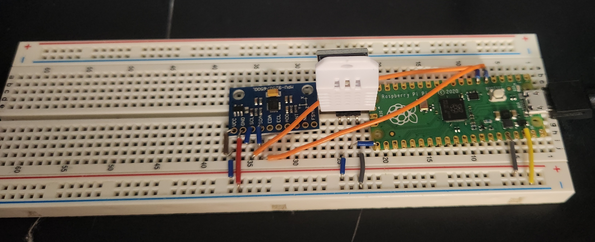

#### 4. High-Strength Shock Tether & Recovery Mechanics
- Engineered to eliminate wadding burn-through experienced on earlier flights, incorporating a flame-resistant Nomex cloth piston designed to isolate recovery gear from hot ejection gases.
- Replaced elastic cords with **9 feet of 350-lb braided Kevlar shock tether**, anchored directly to the motor mount centering ring and the payload coupler arch using high-temperature JB-Weld epoxy.
- Sized a 24" ripstop nylon parachute for a controlled 5.65 m/s touchdown velocity.

#### 5. Propulsion & Positive Mechanical Washer Retention
- Designed a positive mechanical motor retention system replacing breakable plastic Z-clips with dual #6 steel machine screws and 3/8" zinc fender washers that overlap the motor casing rim.
- Infused pre-threaded 3D-printed pilot holes with thin cyanoacrylate (CA) glue to chemically harden plastic internal threads against repeated high-torque clamp cycles.
- Added a 3D-printed forward stopper ring to transmit motor thrust loads directly into the airframe structure.

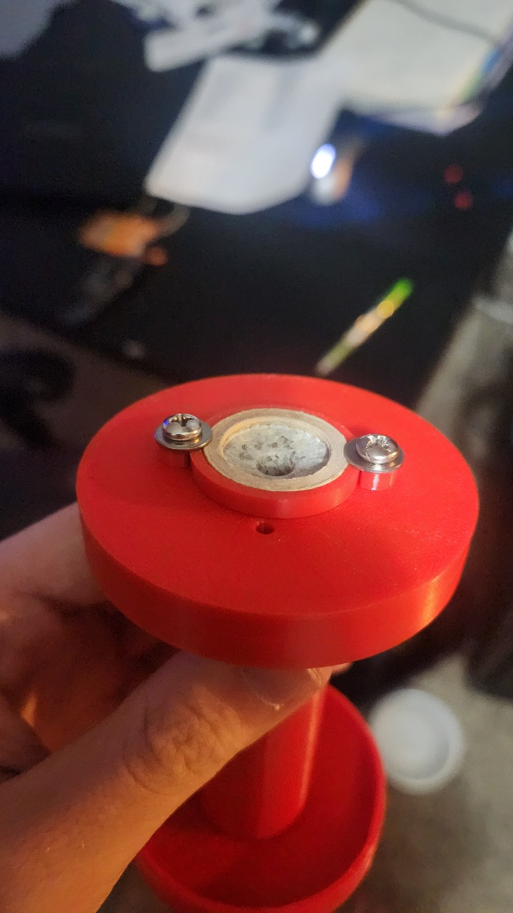

#### 6. Payload Carrier CAD & Extraction Sled
- Modeled the modular BT-80 payload carrier in SolidWorks with integrated upper and lower coupler shoulders to eliminate separate coupler tubes.
- Integrated internal slide channels and mounting bosses for a pull-ribbon avionics sled, allowing rapid battery swap and USB-C MicroPython flashing without disassembling the vehicle.
- Modeled a 4-legged shock cord anchor arch spanning the aft bulkhead to distribute parachute opening shock into the outer cylinder wall.

#### 7. Trajectory Drift & Range Safety Dispersion Analysis
- Analyzed field boundaries and recovery dispersion at Freestone Park (360 &times; 240 m multi-use turf field).
- Trajectory simulations with a 5° launch rod tilt into 7 mph ambient desert winds predict a nominal drift of ~20 m and a worst-case landing radius of **35 m (114 ft)**, safely inside the 120 m field boundary under the modeled conditions.

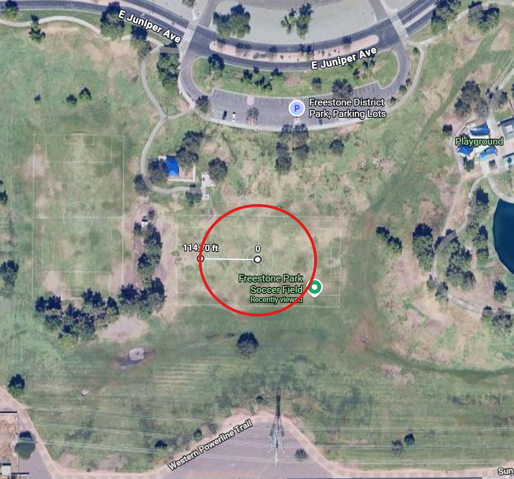

#### 8. Field Launch Operations & Range Protocol
- Built a portable launch kit and followed safety procedures developed through preliminary flights at Freestone and Crossroads Parks.
- Used an Estes Porta-Pad E with a 5-ft steel launch rod to ensure safe rod exit velocity and minimize weathercocking.
- Completed the maiden test flight on an Estes D12-3 motor at Freestone Park, with plans for a higher-altitude flight under mid-power Aerotech F32T-6 propulsion at an NAR club launch.

#### 9. First Test Flight & Simulation Comparison (September 19, 2026)

On September 19, 2026, I launched the rocket for the first time at Freestone Park in Gilbert, AZ. Weather was approximately 100°F with ~7 mph wind from the WSW. I launched on an Estes D12-3 motor with the 5-ft rod angled 5° into the wind, and launched with an empty payload bay to focus the test on basic vehicle flight performance.

The rocket had a clean liftoff from the rod, a stable ascent, deployed its parachute near apogee, and drifted back down onto the grass.

| Airframe on Launch Rod | Maiden Flight Liftoff | Recovered Intact on Grass |
| :---: | :---: | :---: |
| 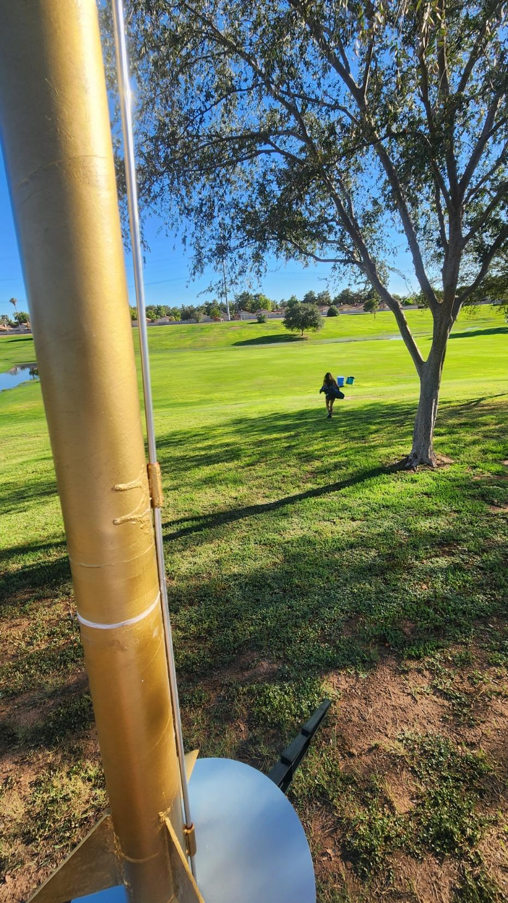 | 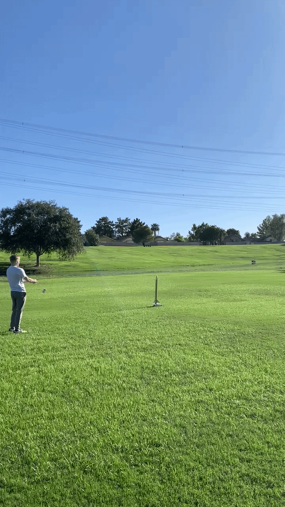 | 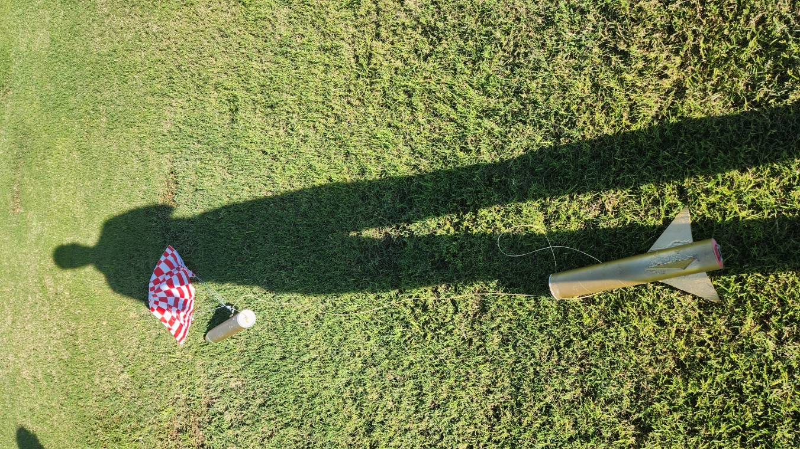 |
| *View looking up along the airframe and launch rod from the blast deflector.* | *Handheld liftoff clip ([mid-launch photo](assets/rocket_flight_midlaunch.jpg) &bull; [full 39s video](assets/rocket_test_flight_1.mp4)).* | *Rocket recovered intact on grass.* |

##### 5° Angle OpenRocket Simulation vs. Observed Flight

| Metric | OpenRocket Simulation (5° Tilt) | Observed Flight | Difference / Notes |
| :--- | :---: | :---: | :--- |
| **Total Flight Time** | **26.8 s** | **27.06 s** | **+0.26 s** (actual flight lasted 0.26 s longer than predicted) |
| **Time to Apogee** | **4.79 s** | **~4.79 s** | Observed coast timing lined up closely with the 4.79 s prediction |
| **Parachute Deployment** | ~4.8 s (delay charge) | **~5.0 s** | Observed ejection shortly after apogee; canopy opened cleanly |
| **Descent with Parachute** | ~22.0 s | **~21 s** | Steady descent under 24" parachute; landed within park bounds |
| **Recovery Condition** | Nominal recovery | **Intact** | Rocket recovered intact with no visible structural damage |

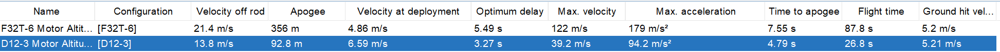

##### Testing Notes & Instrumentation Limitations
- **Tripod Camera Overheating:** The dedicated tripod camera overheated in the ~100°F Arizona heat and failed to record, so the available video for analysis came from handheld phone footage.
- **Velocity Estimate Excluded:** Video analysis produced an estimated velocity of 6.025 m/s shortly after leaving the launch rod, compared with 13.8 m/s predicted by OpenRocket. However, the video analysis was not reliable enough to determine whether this difference reflects the actual flight, so I excluded the velocity estimate from the main simulation comparison.
- **Next Steps:** Flight 1 confirmed that the airframe geometry, 1.60 cal stability margin, motor retention, and Nomex parachute deployment work as expected in flight. The next milestone is completing the flight computer—wiring the BMP390 barometer and MPU-6500 IMU to the Raspberry Pi Pico, building the payload bay mounting sled, and recording onboard altitude and acceleration on Flight 2.

---

## 02 / Computational Aerospace &bull; Simulation: OpenRocket 3D Flight Visualizer

**Project Status:** Complete &bull; **Three.js WebGL Simulation Replay**  
**Role:** Computational Tools Developer &bull; **Tools:** Three.js (WebGL), Web Audio API, Vanilla JavaScript, OpenRocket CSV

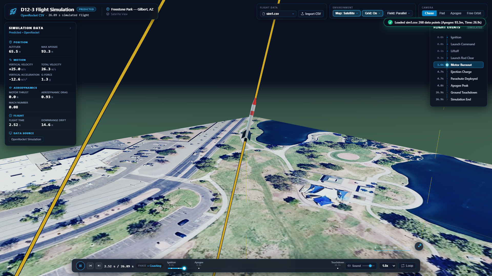
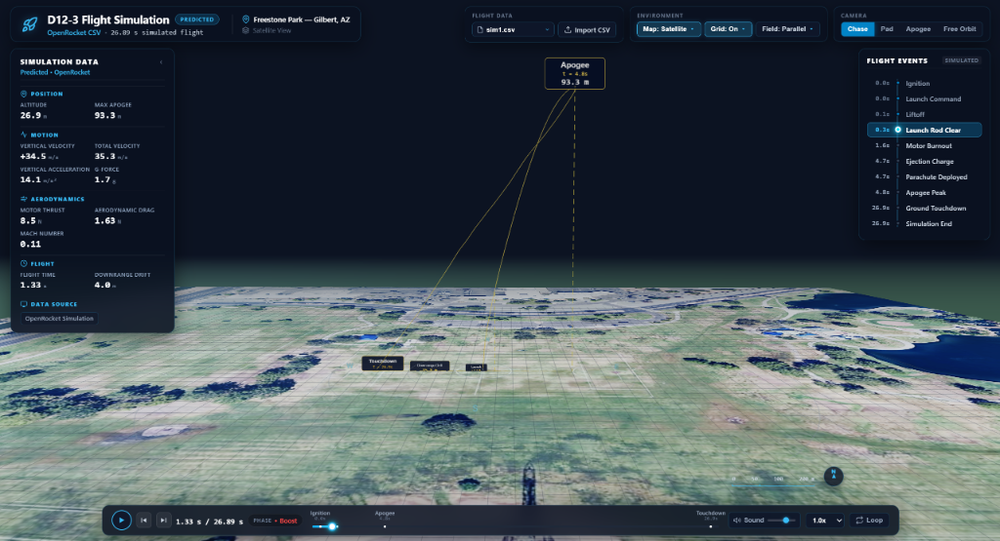

OpenRocket provides numerical simulation output and standard 2D Cartesian plots (altitude vs. time, velocity vs. time). While valuable for engineering analysis, interpreting how tabular CSV rows correspond to three-dimensional vehicle dynamics, apogee turnover, and downrange drift relative to a specific launch field is difficult from 2D plots alone.

I developed the **OpenRocket 3D Flight Visualizer** to transform simulation CSV exports into an interactive 3D flight replay:
- **Simulation Data Parser & Temporal Interpolator:** Ingests raw OpenRocket CSV exports with delimiter auto-detection and comment/event parsing. Uses binary search lookup and linear interpolation (`lerp`) across predicted physical states to generate smooth 60 FPS playback from discrete 10–50 ms simulation steps at variable speeds ($0.25\times$ to $10.0\times$).
- **Calibrated Geographic Launch Environment:** Renders an aerial satellite map of Freestone Park ($4095 \times 4095\text{ px}$ at $0.1247\text{ m/pixel}$, spanning a $510.7\text{ m} \times 510.7\text{ m}$ domain) aligned with OpenRocket's $+X$ (East) and $-Z$ (North) coordinate frame, with an optional dark engineering grid and 50m range rings.
- **Vehicle Attitude Visualization:** The airframe attitude is procedurally derived from the trajectory's instantaneous velocity vector tangent ($\frac{d\vec{P}}{dt}$) through boost and apogee turnover; a procedural 12-line hemispherical parachute canopy deploys with a modeled pendulum oscillation to visually represent descent dynamics.
- **Real-Time Simulation Data HUD & Procedural Audio:** Displays predicted flight state variables (altitude, vertical/total velocity, acceleration, G-force, thrust, drag, Mach, downrange drift). Synthesizes flight acoustics in real time using the browser Web Audio API, modulating motor rumble from simulation thrust ($N$) and airflow rushing from total velocity ($m/s$). Audio is entirely procedural; it is not recorded acoustic telemetry.
- **Pre-Loaded Rocket Datasets:** Pre-configured with actual simulation data from my sounding rocket builds, including the Freestone Park Estes D12-3 maiden flight model and the Aerotech F32T-6 mid-power upgrade trajectory.

> **Scope Note:** This application visualizes predicted simulation models exported from OpenRocket. It is a simulation visualization engine, not a hardware telemetry receiver or measured flight tracking station.

---

## 03 / Computational Physics &bull; Numerical Modeling: Electric Potential ($V$) vs. Potential Energy ($U$)

**Project Status:** Complete &bull; **Single-File Application with Embedded Libraries**  
**Role:** Computational Physics Modeler &bull; **Context:** University Physics (PHY 121 / 131)  
**Tools:** Three.js (WebGL), Velocity Verlet Integrator, KaTeX Typesetting, HTML5 / CSS3

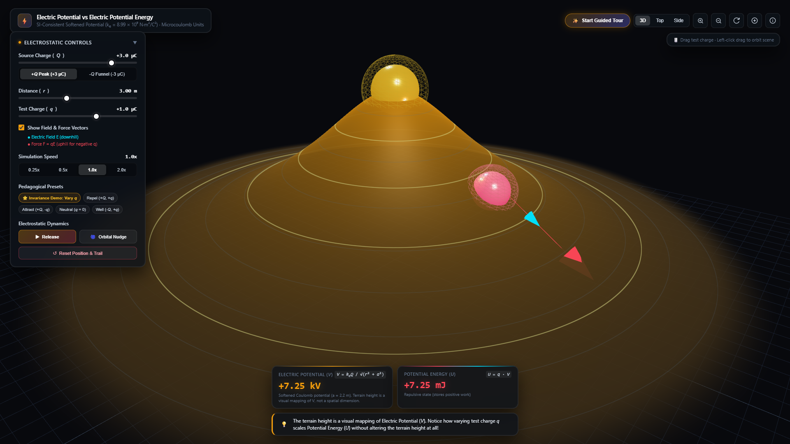
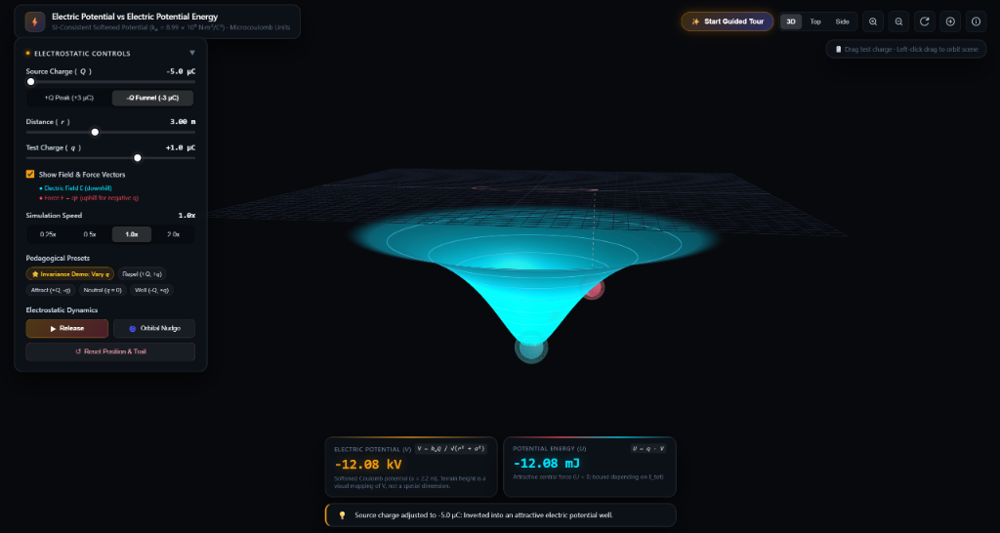

In introductory university physics, students routinely conflate **Electric Potential** ($V$) with **Electric Potential Energy** ($U$). I designed and built an interactive 3D WebGL physics tool to make their fundamental mathematical distinction clear through a single, verifiable experiment:

### The Core Invariance Experiment
For a fixed source-charge configuration $Q$ and a fixed spatial position $r$, the modeled electric potential field ($V$) remains strictly unchanged regardless of the test charge $q$ placed at that position.

In the simulation model:
- Source charge $Q = +3.0\ \mu\text{C}$ and test position $r = 3.0\text{ m}$ are held fixed.
- Varying test charge $q$ from $-3.0\ \mu\text{C} \to 0 \to +3.0\ \mu\text{C}$ leaves the modeled electric potential terrain elevation ($V \approx +7.25\text{ kV}$) completely invariant.
- Meanwhile, the stored system potential energy ($U = q \cdot V$) scales proportionally from $-21.75\text{ mJ}$ to $0\text{ mJ}$ to $+21.75\text{ mJ}$, reversing sign when $q$ flips polarity.

### Mathematical Formulation & Numerical Methods
1. **Softened Plummer-Type Potential:** Uses $V(r) = \frac{k_e Q}{\sqrt{r^2 + a^2}}$ with core radius $a = 2.2\text{ m}$ (standard Coulomb constant value $k_e = 8.98755 \times 10^9\text{ N}\cdot\text{m}^2/\text{C}^2$) to eliminate $r=0$ singularities in this numerical model while approaching classic $1/r$ behavior asymptotically ($r \gg a$).
2. **Velocity Verlet Numerical Integration:** Particle dynamics occur strictly in the horizontal $xz$-plane under spatial gradient forces ($\vec{F}_{xz} = q\vec{E}_{xz} = -q\nabla V$, with $\vec{E}(x, z) = \frac{k_e Q}{(r^2 + a^2)^{3/2}}(x\hat{i} + z\hat{k})$). Numerical tests showed total mechanical energy ($E_{\text{tot}} = U + K$) drift below 0.1% over tested simulation intervals.
3. **Decoupled Visual Terrain Elevation:** The vertical dimension ($y_{\text{render}} = V_{\text{SI}} / 2500$) is purely a visual elevation mapping of the scalar potential, **not a physical spatial degree of freedom**. The particle does not roll down a gravitational slope.
4. **Attraction vs. Bound States & Precession:** Visualizes that for the modeled attractive potential with $U(\infty) = 0$, negative total mechanical energy ($E_{\text{tot}} < 0$) corresponds to energetically bound trajectories, while nonnegative-energy trajectories escape. Departure from pure $1/r$ symmetry at small radii produces precessing rosette orbits rather than closed Keplerian ellipses.
5. **Self-Contained Single-File Architecture:** Single-file web application with embedded dependencies (Three.js, KaTeX) and no npm/build step, featuring a 6-step guided tour, 3D raycast charge repositioning, and engineering prefix auto-formatting ($\text{kV}, \text{mJ}, \mu\text{J}$).

---

## 04 / Mechanical Design: 10-Part SolidWorks Desk Fan Assembly

**Role:** Mechanical CAD Designer &bull; **Discipline:** Parametric Design &bull; **Tool:** SolidWorks 3D CAD

- Modeled 10 discrete mechanical parts from dimensioned paper sketches to a fully constrained assembly: Front Grill, Back Grill with pattern cuts, Aerodynamic Fan Blades, Center Hub, Motor Housing, On/Off Switch Knob, Shaft, Frame Ring, Vertical Stand, and Base.
- Applied **concentric, coincident, and rotational mechanical mates** to simulate smooth 360° blade rotation with zero interference.
- Checked clearances between rotating blades and housing to ensure no dynamic part collision.
- Generated comprehensive **2D ANSI manufacturing drawings** detailing dimensions, datum references, and standard tolerances.
- Produced multi-angle photorealistic renders in SolidWorks PhotoView.

| Isometric 3/4 View | Profile / Side View | Front Elevation View | Rear Housing View |
| :---: | :---: | :---: | :---: |
|  |  |  |  |

---

## 05 / Simulation & Software Tools

### 1. Solar Energy Systems Modeling & NPV Optimization (MATLAB)
**Role:** Lead Mathematical Modeler &bull; **Domain:** Renewable Energy Systems &bull; **Tool:** MATLAB

- Served as primary mathematical modeler on a 5-person engineering team sizing an off-grid residential solar and battery storage system for Chandler, Arizona.
- Formulated mathematical energy-balance equations correlating seasonal solar angles with photovoltaic panel output.
- Modeled battery storage discharge profiles and multi-day reserve requirements against summer cooling loads.
- Calculated Net Present Value (NPV) lifecycle economic models comparing two competing battery configurations over a 25-year lifespan.
- Completed MathWorks MATLAB Onramp Certification and validated multi-day storage balance models.

---

### 2. Smart Schedule Finder Desktop Application (Python & Streamlit)
**Role:** Creator & Developer &bull; **Workplace:** Mobile Hearing Solutions &bull; **Tools:** Python, Streamlit, Google Calendar API

- Built a desktop application in Python and Streamlit for Mobile Hearing Solutions to automate technician scheduling across the Phoenix metro area.
- Queries the Google Calendar API via OAuth2 authentication with automatic background token refresh to ingest real-time schedules.
- Evaluates proposed patient addresses against existing technician routes to minimize cross-town driving time.
- Features single-patient lookups and automated batch searches (next 5 patients), saving an estimated 2 to 3 hours of manual route cross-referencing weekly in active office use.

---

### 3. Local Document OCR Extraction Pipeline
**Role:** Technical Assistant &bull; **Workplace:** Mobile Hearing Solutions &bull; **Tools:** Python, EasyOCR, Phi-4 Mini (4-bit)

- Implemented an offline document extraction pipeline to pull patient demographic, insurance, and doctor referral fields from incoming faxed PDFs into structured records.
- Tested and ran 4-bit quantized local vision models (Phi-4 Mini) alongside EasyOCR.
- Operates 100% locally on office workstations to maintain strict patient privacy in compliance with HIPAA guidelines and eliminate cloud API fees.
- Includes manual verification flags for low-confidence scans to ensure data accuracy before database ingestion.

---

## 06 / Aerospace Industry Experience: Able Aerospace (Textron Aviation)

**Role:** Engineering Specialist Job Shadow &bull; **Location:** Mesa, AZ &bull; **Date:** August 2026  
**Facility:** FAA Part 145 Repair Station & Aerospace Manufacturing Facility

- **FAA Airworthiness Documentation:** Shadowed an engineering specialist reviewing engineering change orders, confirming airworthiness data, and walking through documentation submitted to the FAA under **Form 8110-3** for custom repairs and parts.
- **Flight-Critical Component Machining:** Toured the machine shop and observed multi-axis CNC milling of high-stress aircraft components including helicopter rotor hubs, transmission drive shafts, and landing gear parts.
- **Surface Treatments & Tooling:** Observed shot-peening processes used to induce compressive stress and prevent fatigue cracking, electroplating lines, and how engineers use SolidWorks in-house to design custom inspection fixtures and water-testing tanks.

---

## 07 / Technical Skills & Tools

| Category | Core Skills, Tools & Methods |
| :--- | :--- |
| **01 — Aerodynamics & Propulsion** | OpenRocket Flight Simulation, OpenRocket Simulation Data Processing, 3D Trajectory Replay, Trajectory Interpolation, Vehicle Attitude Visualization, Static Stability Margin Tuning, Center of Pressure / Center of Gravity, Fin Geometry Optimization, Motor Sizing (Estes D12-3 / Aerotech F32T-6), Trajectory Drift Dispersion, Nomex Piston Recovery, Positive Washer Retention |
| **02 — Mechanical CAD & 3D Graphics** | SolidWorks (Parametric Part Modeling, Multi-Body Assemblies, Dynamic Rotational Mates, Clearance Verification, 2D ANSI Manufacturing Drawings), Three.js WebGL, Computational 3D Visualization, Web Audio API Synthesis, Bambu Lab A1, Bambu Studio STEP Slicing, eSUN PLA+, Polymaker PETG, Gyroid Infill Optimization, Digital Caliper Tolerancing |
| **03 — Hardware, Computation & Standards** | Raspberry Pi Pico (RP2040), MicroPython, DHT-22 Sensor, BMP390 Barometer, MPU-6500 6-Axis IMU, SPI MicroSD Flash Logging, 350 lb Braided Kevlar, JB-Weld Epoxy, MATLAB, Python, Numerical Modeling, Velocity Verlet Numerical Integration, Electrostatic Potential Modeling, Energy Conservation Checks, Kinematics & Dynamics, NPV Analysis, FAA Part 145 Exposure, FAA Form 8110-3, NAR Safety Code |

---

## Contact & Links

- **Email:** [ashtonh1204@gmail.com](mailto:ashtonh1204@gmail.com)
- **LinkedIn:** [linkedin.com/in/ashton-hendrickson-55508a262](https://www.linkedin.com/in/ashton-hendrickson-55508a262/)
- **GitHub:** [github.com/ashrick12](https://github.com/ashrick12)
- **Live Portfolio Website:** [ashrick12.github.io](https://ashrick12.github.io/)
- **Interactive Webpage:** [Open index.html](index.html)

[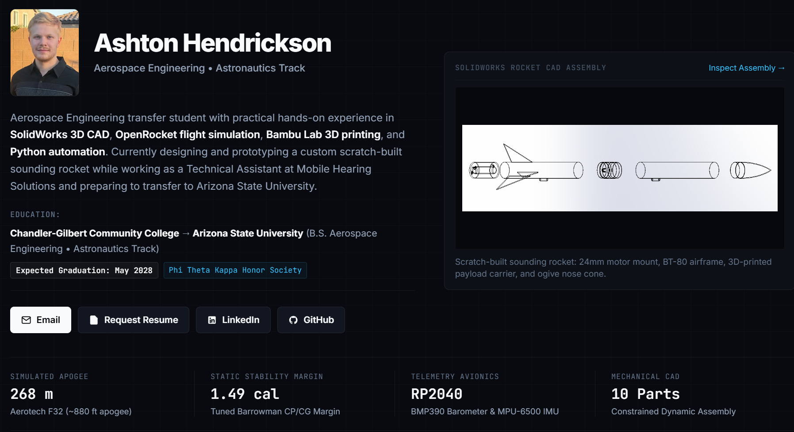](https://ashrick12.github.io/)
